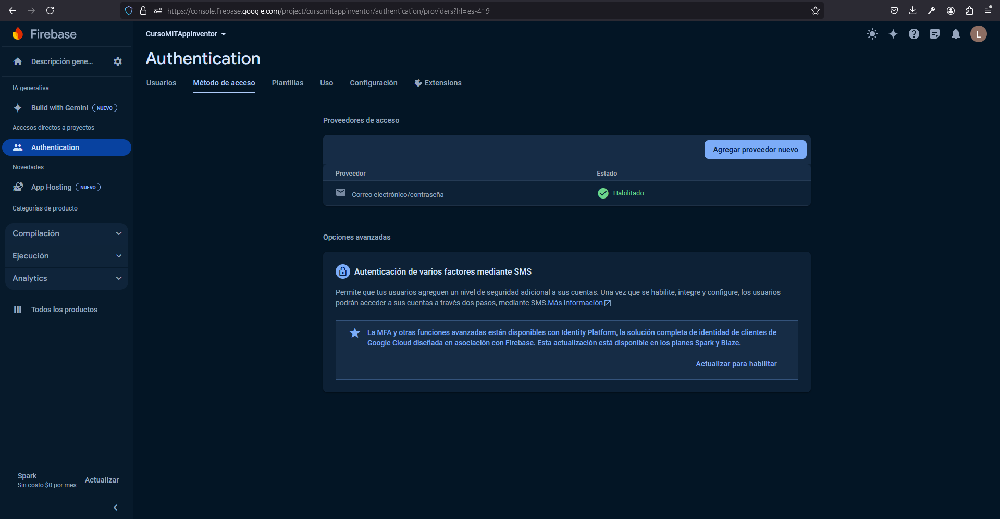

# Capitulo 1: Registro de usuarios

## Configuracion de Firebase

1. Ingresar a la [Consola de Firebase](https://console.firebase.google.com/?hl=es-419).
2. Clic en `Agregar Proyecto`.
3. Ingresar `CursoMITAppInventor` como nombre del proyecto.
4. Clic en `Continuar`.
5. Desmarcar el checkbox `Habilitar Google Analytics para este proyecto`.
6. Clic en `Crear proyecto`.

7. Clic en `Compilacion`.
8. Clic en `Authenticaction`.
9. Clic en `Comenzar`.

10. Clic en `Correo electrónico/contraseña`.

11. Marcar el checkbox `Correo electrónico/contraseña`.
12. Clic en `Guardar`.

13. Clic en `Descripcion general`.
14. Clic en la opcion `Web` en la seccion `Comienza por agregar Firebase a tu app`.

15. Ingresar `MiAppConMITAppInventor` en `Sobrenombre de la app`.
16. Clic en `Registrar app`.
17. Clic en `Ir a la consola`.
18. Clic en `Configuración del proyecto` a la derecha de `Descripcion general`.

19. Crear un archivo llamado `firebase.js`.
20. Agregar el archivo `firebase.js` al archivo `.gitignore`.
21. Copiar la `firebaseConfig` de `MiAppConMITAppInventor` al archivo `firebase.js`.

## Crear el proyecto de MIT App Inventor

1. Ir a la pagina de [MIT App Inventor](https://appinventor.mit.edu/).

2. Clic en `Create Apps!`.
3. Registrarse en la pagina.

4. Clic en `Projects`.
5. Clic en `Start new project`.
6. Ingresar `MiAppConFirebase` en `Project name`.

## Crear los [virtual screens](http://ai2.appinventor.mit.edu/reference/other/manyscreens.html) de la aplicacion

1. Crear el [virtual screen](http://ai2.appinventor.mit.edu/reference/other/manyscreens.html) `Start`.

2. Crear el [virtual screen](http://ai2.appinventor.mit.edu/reference/other/manyscreens.html) `Register`.

3. Desmarcar el check de la propiedad `Visible` del componente `vaRegister`.
4. Marcar el check de la propiedad `Visible` del componente `vaStart`.

## Crear los [bloques](https://ai2.appinventor.mit.edu/reference/blocks/) de la aplicacion

MIT App Inventor trabaja con las API REST:

- [Using Web APIs with JSON](https://ai2.appinventor.mit.edu/reference/other/json-web-apis.html)

Por lo que vamos a utilizar la [API REST de autenticación de Firebase](https://firebase.google.com/docs/reference/rest/auth?hl=es-419).

1. Clic en `Blocks`.

2. Crear el siguiente diagrama de bloques:

3. Ingresar el valor de `apiKey` que esta en el archivo `firebase.json`.

Lo hecho esta basado en el ejemplo:

- [Registration & Login with Firebase Authentication](https://ai2.metricrat.co.uk/guides/registration-login-with-firebase-authentication)

## Prueba de la aplicacion

1. Clic en `Connect`.
2. Clic en `AI Companion`.

3. Abrir la aplicacion [MIT AI2 Companion](https://play.google.com/store/apps/details?id=edu.mit.appinventor.aicompanion3&hl=en) en nuestro dispositivo Android.
4. Escanear el codigo QR.

## Backup del proyecto de MIT App Inventor

1. Clic en `Projects`.
2. Clic en `Export selected project (.aia) to my computer`.

## Restaurar el proyecto de MIT App Inventor

1. Clic en `Projects`.
2. Clic en `Import project (.aia) from my computer ...`.
3. Clic en `Examinar...`.
4. Seleccionar nuestro archivo con extension `.aia`.