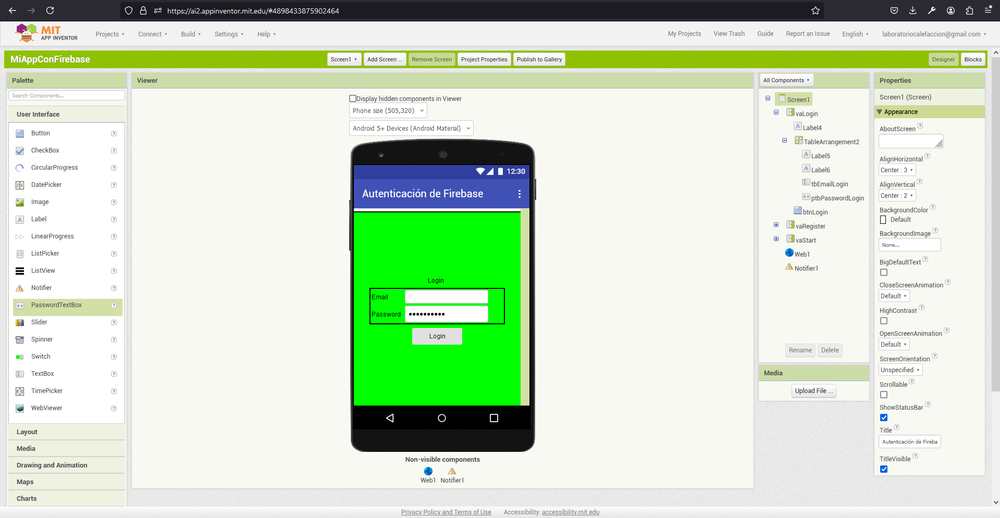
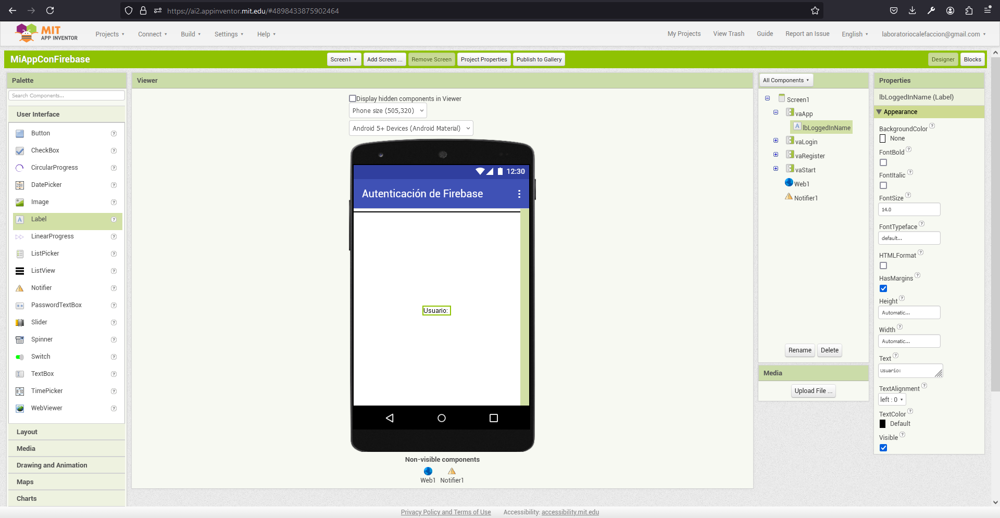
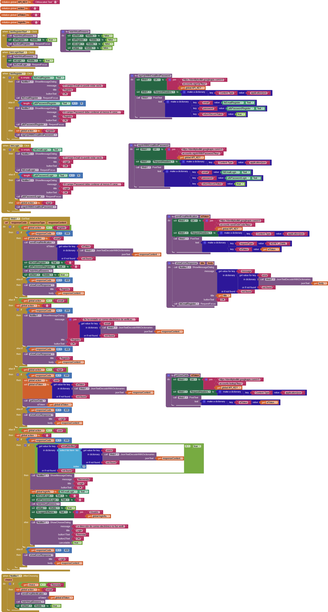

# Capitulo 2: Login de usuarios

## Agregar [virtual screens](http://ai2.appinventor.mit.edu/reference/other/manyscreens.html) a la aplicacion

1. Crear el [virtual screen](http://ai2.appinventor.mit.edu/reference/other/manyscreens.html) `Login`.

2. Crear el [virtual screen](http://ai2.appinventor.mit.edu/reference/other/manyscreens.html) `App`.

3. Desmarcar el check de la propiedad `Visible` del componente `vaLogin`.
4. Desmarcar el check de la propiedad `Visible` del componente `vaApp`.

## Modificar los [bloques](https://ai2.appinventor.mit.edu/reference/blocks/) a la aplicacion

1. Modificar el diagrama de bloques:

Lo hecho esta basado en el ejemplo:

- [Registration & Login with Firebase Authentication](https://ai2.metricrat.co.uk/guides/registration-login-with-firebase-authentication)